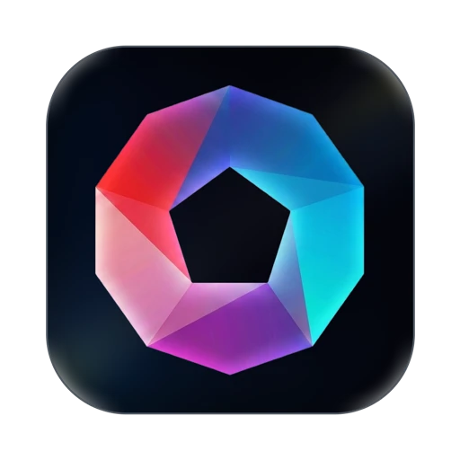

<div align="center">
  

# WandPlus

**An open standard for building Wands — stateful, staged objects an AI agent crafts on disk.**

[](./CHANGELOG.md)
[](./schema/wand.schema.json)
[](./LICENSE)

[Website](https://wandplus.dev) · [Quickstart](./docs/quickstart.md) · [Spec](./spec) · [Reference runtime](https://mcplato.com)

</div>

---

A **Wand** is the missing primitive between a tool and an instruction. Instead of *asking* a
model to produce something and hoping it follows the steps, you hand it an object that already
knows how it's supposed to be built: a directory with a workflow, per-stage rules about what can
be written, and gates that decide when each stage is done.

```
CreateWand(app_id: "acme.docs.changelog", name: "v1.2.0 release")
  → WandWrite("entries/auth.md", ...)   # collect stage
  → CheckPhase()                         # gate passes → advances
  → WandWrite("CHANGELOG.md", ...)       # publish stage
  → CheckPhase({ version: "1.2.0" })     # gate passes → done
  → SaveAndCloseWand()
```

## Why Wands

Wands sit alongside two primitives you may already know:

| | MCP server | Skill | **Wand** |
|---|---|---|---|
| What it is | A set of callable tools | A reusable instruction fragment | A **stateful object** crafted on disk |
| State | Stateless | Stateless | Persistent (`.wand.json` + files) |
| Has a workflow | No | No | Yes — phases with gates |
| Constrains writes/tools | No | No | Yes — per phase |
| Has its own UI | No | No | Optional — declarative HTML views |
| Authored as | Code | `SKILL.md` prose | `wand.json` + prompts + gates |

If your feature is "let the agent *call* something," that's an MCP tool. If it's "teach the
agent *how* to do something," that's a Skill. If it's "have the agent *build and refine an
object* through stages, with rules about what's valid at each stage," that's a **Wand**.

## How it works

1. A **wand app** is identified by a reverse-DNS `appId` (like an iOS bundle id) and declares
   everything in `wand.json`: identity, entitlements, a directory contract, a **phase** workflow,
   and optionally its own presentation views.
2. Each **phase** injects its own instructions, exposes its own tools, and fences what can be
   written — and advances only when its **gate check** passes.
3. Every instance the agent crafts is a **document package**: a `<wandId>.wand` directory with a
   `.wand.json` identity marker, recognized anywhere it sits and opened like a document.
4. The runtime drives the agent through the phases, enforces the rules, and persists state so a
   wand can be closed, reopened, copied, or rewound.

Authoring a wand is **declarative** — no host code. You write a manifest, a few markdown prompts,
small gate scripts, and (optionally) a plain HTML view.

## Get started

- **[Quickstart](./docs/quickstart.md)** — build your first wand (a `changelog`) in ~15 minutes.
- **[Authoring guide](./docs/authoring-guide.md)** — the full manifest reference, phase and gate
  design, tool exposure, and a pre-ship checklist.
- **[`examples/changelog`](./examples/changelog)** — a complete, runnable reference wand,
  including a static presentation view.

## Repository layout

```
WandPlus/
├── spec/                  # The normative protocol
│   ├── manifest.md        #   wand.json — identity, entitlements, contract, workflow
│   ├── bundle.md          #   on-disk forms: kind bundle + <wandId>.wand document package
│   ├── lifecycle.md       #   phases, gate checks, baseline tools, rewind/copy/completion
│   ├── presentation.md    #   two-layer view model (static + runtime)
│   └── host-api.md        #   /__wandhost__/, window.wandHost JSAPI, events, security
├── schema/
│   └── wand.schema.json   # Canonical JSON Schema for the manifest
├── sdk/                   # Reference host assets a compliant runtime serves verbatim
│   ├── sdk.js             #   window.wandHost (postMessage RPC, state, theme)
│   ├── viz.js             #   visualization kit: data-wv-mode diagrams + HUD
│   └── theme.css          #   default --wv-* theme tokens
├── docs/
│   ├── quickstart.md      # Tutorial: your first wand in ~15 minutes
│   └── authoring-guide.md # Full authoring reference + checklist
├── examples/
│   └── changelog/         # Complete runnable reference wand
├── assets/                # Logos and brand assets
└── CHANGELOG.md           # Protocol version history
```

## The spec

The normative protocol lives in [`spec/`](./spec):

- **[manifest.md](./spec/manifest.md)** — the `wand.json` manifest: identity (`appId` /
  `appVersion` / `displayName`), entitlements, directory contract, workflow.
- **[bundle.md](./spec/bundle.md)** — the two on-disk forms: the kind bundle you author, and the
  `<wandId>.wand` document package the agent produces.
- **[lifecycle.md](./spec/lifecycle.md)** — phases, gate checks (script + prompt), the baseline
  tool set, rewind/copy/completion, cross-wand composition.
- **[presentation.md](./spec/presentation.md)** — the two-layer view model: a static view shipped
  with the app, and a runtime view over the produced artifact.
- **[host-api.md](./spec/host-api.md)** — `/__wandhost__/`, the `window.wandHost` JSAPI, the
  postMessage envelope, events, and the security model.

[`sdk/`](./sdk) contains the reference `sdk.js` / `viz.js` / `theme.css` any compliant runtime
can serve verbatim.

> **Schema URL:** the manifest's canonical `$id` is
> `https://raw.githubusercontent.com/mcplato-dev/WandPlus/main/schema/wand.schema.json`,
> served straight from this repository. You can also validate against the local
> [`schema/wand.schema.json`](./schema/wand.schema.json).

## Runtimes

WandPlus is an **open, runtime-agnostic standard**: any agent runtime can implement the Wand
contract. The official site is [wandplus.dev](https://wandplus.dev).

<table>
  <tr>
    <td><a href="https://mcplato.com"></a></td>
    <td><strong><a href="https://mcplato.com">MCPlato</a></strong> — the first reference runtime.
    Ships the full Wand lifecycle (authoring, gates, presentation layer, document-package opener)
    inside an AI-native workspace.</td>
  </tr>
</table>

Building a runtime? Serve the [`sdk/`](./sdk) assets on `/__wandhost__/`, implement the method
whitelist in [host-api.md](./spec/host-api.md), and validate manifests against the
[schema](./schema/wand.schema.json).

## Contributing

WandPlus is developed and maintained at
**[github.com/mcplato-dev/WandPlus](https://github.com/mcplato-dev/WandPlus)**.

```bash
git clone https://github.com/mcplato-dev/WandPlus.git
```

Issues and pull requests are welcome — spec clarifications, new examples, and runtime
implementation reports are especially valuable. Protocol changes are tracked in the
[CHANGELOG](./CHANGELOG.md).

## Status

The format is stabilizing around protocol **`version: "2.0"`** — App-Store-style identity
(`appId` + entitlements), `.wand` document packages, and the two-layer presentation model.
v1 manifests are no longer recognized; see the [CHANGELOG](./CHANGELOG.md) for the breaking
changes.

## License

[Apache License 2.0](./LICENSE).
